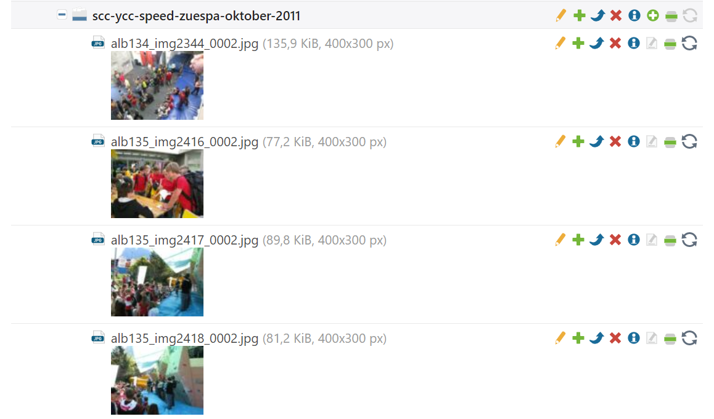

# Rotate images in the Contao File Manager

This is a small extension for Contao CMS, which allows you nothing more than to rotate images in the Contao File Manager.

## Requirements

- PHP 8.2 or higher with the `imagick` extension (Contao 6 requires a more recent PHP version)
- Contao 5.3 or Contao 6

Contao 4.13 is no longer supported. Please use version 1.x of this extension for Contao 4.13.

## Permissions

The rotate button is only active for images (GIF, JPEG, PNG, WebP, AVIF, HEIC, JPEG XL).
Regular backend users additionally need the file operation permission "Edit files" and access
to the file via their file mounts.
